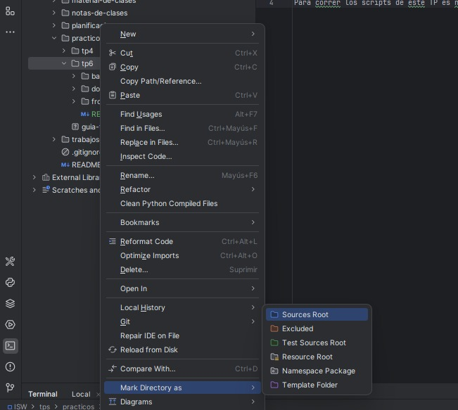

# README: Proyecto Inscripción de Actividades (TP6)

Este proyecto implementa la US "inscribirme a actividades" utilizando la metodología **TDD (Test-Driven Development)**, con **Python** y **Pytest**.

---

## 1. Configuración del IDE (Sources Root)

Este paso es **obligatorio y local** para que el IDE (PyCharm, VS Code) resuelva los *imports* (ej., `from back.src...`) sin errores de **`ImportError`**.

1. Haz clic derecho en la carpeta **`tp6`** y márcala como **"Sources Root"** (Raíz de Fuentes).



---

## 2. Dependencias Requeridas 

| Paquete | Instalación | Propósito |
| :--- | :--- | :--- |
| **`pytest`** | `pip install pytest` | Marco de trabajo para la ejecución de tests unitarios. | 

Versiones de python > 3.9 para evitar fallas relacionadas a nomenclaturas


---

## 3. Ejecución de Tests Unitarios

Asegúrate de que la terminal esté posicionada en la raíz del proyecto (carpeta `tp6`).

### Opción A: Ejecución Directa de Pytest

```bash
pytest -v back/tests/test_inscripcion.py
 ```
### Opción B: Ejecución como Módulo Python
Si la Opción A falla debido a problemas con el PATH, utiliza:

```bash
python -m pytest -v back/tests/test_inscripcion.py
 ```
---

## 4. Ejecución del Programa

El proyecto se divide en dos partes: backend (API) y frontend (interfaz de usuario).
Ambos deben ejecutarse de forma independiente en terminales separadas.

# 🖥️ Backend (FastAPI con Uvicorn)

Abre una terminal en la carpeta raíz del proyecto:

C:\Users\roffe\OneDrive\Desktop\4to\ISW\repo\repo-isw-25-grupo10\practicos\tp6


Ejecuta los siguientes comandos:

pip install fastapi uvicorn

python -m uvicorn back.app:app --reload


El servidor se iniciará en modo desarrollo en:

http://127.0.0.1:8000


Puedes verificar la documentación interactiva de la API en:

Swagger UI: http://127.0.0.1:8000/docs

Redoc: http://127.0.0.1:8000/redoc

De no funcionar, ejecuta los siguientes comandos:
pip install fastapi uvicorn
python -m back.app
uvicorn back.app:app --reload --host 0.0.0.0 --port 8000  

# 🌐 Frontend (React + Vite)

Abre una nueva terminal en la carpeta del frontend:

C:\Users\roffe\OneDrive\Desktop\4to\ISW\repo\repo-isw-25-grupo10\practicos\tp6\front\ecoharmony-ui


Instala las dependencias (solo la primera vez):

npm install


Inicia el servidor de desarrollo:

npm run dev


El sitio estará disponible en:

http://localhost:5173

# 🔄 Integración entre Front y Back

El frontend se comunica con la API en http://127.0.0.1:8000.
Asegúrate de tener ambos servidores corriendo simultáneamente para que las funcionalidades de inscripción funcionen correctamente.
