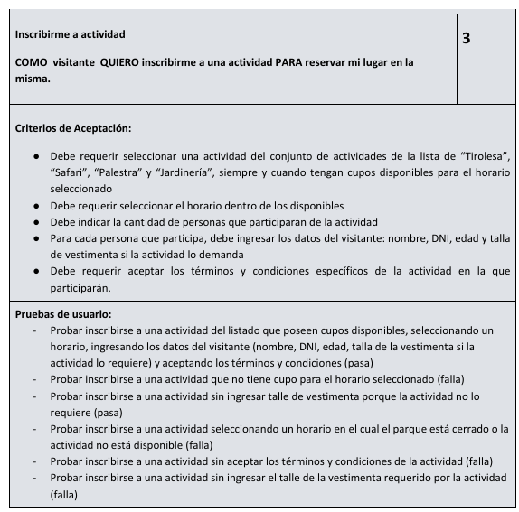

# 🌿 Especificaciones de Inscripción a Actividades del Parque Natural

Este documento detalla los requisitos, condiciones y lineamientos para la inscripción a las actividades recreativas del **Parque Natural**.  
Incluye la gestión de cupos, horarios, requisitos de edad, términos y condiciones aplicables, y detalles sobre la interfaz y diseño.

---
## USER STORY

---

## 1️⃣ Cupos disponibles por actividad

| Actividad   | Cupos disponibles |
|--------------|------------------|
| 🐾 **Safari**       | 8  |
| 🧗 **Palestra**     | 12 |
| 🌱 **Jardinería**   | 12 |
| 🪂 **Tirolesa**     | 10 |

---

## 2️⃣ Horarios de las actividades

| Parámetro | Detalle |
|------------|----------|
| 🕘 **Horario general** | 9:00 a 18:00 |
| ⏱️ **Duración por turno** | 30 minutos |
| 🔁 **Turnos por hora** | 2 |
| 📅 **Días de apertura** | Todos los días **menos los lunes** y días festivos (25 de diciembre y 1° de enero) |

---

## 3️⃣ Vestimenta

- **Actividades que requieren vestimenta especial:**  
  🧗 Palestra y 🪂 Tirolesa.  
- **Talles disponibles:** XS, S, M, L, XL, XXL.  
- **Disponibilidad:** Hay suficiente stock para todos los inscriptos.  

---

## 4️⃣ Términos y Condiciones

Los **términos y condiciones** deberán mostrarse en un **popup o modal** al momento de confirmar la inscripción.  
El texto que se muestra a continuación constituye el **modelo oficial y obligatorio** a utilizar en todas las inscripciones del Parque Natural:

---

# 📜 Términos y Condiciones de Participación

Al inscribirse en cualquiera de las actividades ofrecidas por el **Parque Natural**, el/la participante declara haber leído, comprendido y aceptado los presentes términos y condiciones, comprometiéndose a cumplir con las normas de seguridad y convivencia establecidas por la organización.

---

### 🏞️ Aceptación de riesgos  
Las actividades se desarrollan en entornos naturales y pueden implicar cierto nivel de riesgo físico.  
El/la participante **asume voluntariamente dichos riesgos**, comprometiéndose a acatar las indicaciones del personal y a mantener una conducta responsable durante toda la actividad.

---

### 🎟️ Condiciones de participación  

- No se permitirá la participación bajo efectos de alcohol, medicamentos o sustancias que alteren el estado físico o mental.  
- Los **menores de edad** deberán contar con la **autorización y supervisión** de un adulto responsable.  
- El **Parque Natural** podrá **suspender, modificar o reprogramar** actividades por razones climáticas, de seguridad o fuerza mayor.  
- La **inscripción anticipada** podrá realizarse hasta **2 días antes** de la fecha de la actividad.  
- La participación queda sujeta a la **disponibilidad de cupos** al momento de la inscripción.

---

### 🦺 Seguridad y equipamiento  

- El uso del **equipamiento de seguridad provisto por el parque** es **obligatorio** en todas las actividades que así lo requieran.  
- El/la participante se compromete a **utilizar correctamente** dicho equipamiento y a **devolverlo en las mismas condiciones** en que fue entregado.  
- Cualquier daño intencional o pérdida del equipo podrá generar cargos adicionales.

---

### ⚖️ Responsabilidad  

El **Parque Natural** no se responsabiliza por pérdidas o daños de objetos personales, ni por lesiones o accidentes derivados del **incumplimiento de las normas de seguridad o de las indicaciones del personal**.  
La inscripción implica la **aceptación total de estas condiciones** y la **renuncia expresa a cualquier reclamo por daños o perjuicios** ocasionados durante la participación en las actividades.

---

### 🔒 Protección de datos personales  

Los datos personales brindados serán utilizados exclusivamente para la **gestión de inscripciones** y comunicaciones vinculadas con las actividades, conforme a la legislación vigente en materia de protección de datos personales.  
El Parque Natural garantiza la confidencialidad y seguridad de la información proporcionada por los participantes.

---

### ✅ Confirmación  

Al confirmar la inscripción, el/la participante declara haber **leído, comprendido y aceptado estos términos y condiciones en su totalidad**.

---

## 5️⃣ Edad mínima y máxima por actividad

| Actividad | Edad mínima | Edad máxima |
|------------|--------------|--------------|
| 🌱 **Jardinería** | Sin límite | Sin límite |
| 🐾 **Safari** | Sin límite | Sin límite |
| 🧗 **Palestra** | 12 años | Sin límite |
| 🪂 **Tirolesa** | 8 años | Sin límite |

---

## 6️⃣ Restricciones de horario
- Una misma persona **no puede estar inscripta en dos actividades en el mismo horario**.

---

## 7️⃣ Inscripción múltiple

- Se permite la **inscripción de varias personas** en un mismo formulario.  
- No existe un **máximo de inscriptos**, pero se debe **validar que haya cupos disponibles** para todos.

---

## 8️⃣ Comprobante de inscripción

Al finalizar la inscripción:
- Se debe **enviar una confirmación por correo electrónico** al participante.  
- Se debe **mostrar un mensaje emergente (popup/modal)** de confirmación en pantalla.  

---

## 9️⃣ Interfaz y diseño

- **Logo del parque:** Debe ser diseñado por el equipo y enviado para validación.  
- **Paleta de colores:** [Coolors Paleta Oficial](https://coolors.co/134611-3e8914-3da35d-96e072-e8fccf)  
- **Fuente:** Montserrat  

---

## 🔟 Pruebas extra

Este apartado se destina a la **documentación de pruebas adicionales** relacionadas con la inscripción a actividades del Parque Natural.

### 🧾 Casos de prueba

| Test Nº | Descripción | Resultado esperado |
|----------|--------------|--------------------|
| **7** | Probar inscribirse a una actividad seleccionando una **edad inválida** para la actividad seleccionada. | ❌ Falla |
| **8** | Probar inscribirse en una actividad en un **horario en el cual el visitante ya tenga otra actividad registrada**. | ❌ Falla |
| **9** | Probar inscribir **más de una persona** a una actividad con **cupos disponibles**, seleccionando un horario, ingresando los datos del visitante (nombre, DNI, edad, talla si aplica) y **aceptando los términos y condiciones**. | ✅ Pasa |
| **10** | Probar inscribir **más de un visitante** a una actividad que **no tiene cupo suficiente** para todos ellos. | ❌ Falla |
| **11** | Probar inscribirse a una actividad cuya fecha **caiga en un día en que el parque está cerrado**. | ❌ Falla |
| **12** | Probar inscribirse a una actividad con una **fecha pasada**. | ❌ Falla |
| **13** | Probar inscribirse a una actividad cuya fecha sea **3 o más días después** de la fecha actual. | ❌ Falla |
| **14** | Probar inscribirse a una actividad ingresando un **correo electrónico inválido**. | ❌ Falla |

